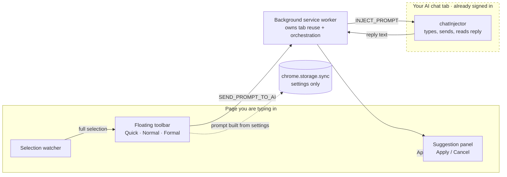

<div align="center">


# Re-Phraser: AI Text Rewriter

**Rewrite text right where you type it - choose a tone, review the suggestion, apply it only if you like it.**

[](https://github.com/atj393/re-phraser/actions/workflows/ci.yml)
[](LICENSE)
[](src/manifest.ts)
[](CHANGELOG.md)

[](https://chromewebstore.google.com/detail/re-phraser-ai-text-rewrit/ldocllepggdbadbedboopoeebadnpddi)

Chrome Web Store: **live** &nbsp;·&nbsp; Microsoft Edge Add-ons: **not submitted** (the same MV3 package builds via `npm run package:edge`)

</div>

---

> Personal productivity extension. Re-Phraser is **not** an AI provider and is **not** affiliated with or endorsed by OpenAI/ChatGPT, Anthropic/Claude, Google/Gemini, Microsoft, or any other AI company.

Re-Phraser helps you rewrite what you have already typed, without leaving the page. Select all the text in a message box, pick **Quick**, **Normal**, or **Formal**, and Re-Phraser sends a personalized rewrite request to **your own AI chat tab** (one you have already opened and signed in to). It brings the reply back as a suggestion so you can **Apply** or **Cancel**. You stay in control of every change.

There is no API key, no separate account, and no Re-Phraser server.

---

## Contents

- [Quick start](#quick-start)
- [The three modes](#the-three-modes)
- [What happens when something is missing](#what-happens-when-something-is-missing)
- [Personalization](#personalization)
- [Privacy](#privacy)
- [Permissions](#permissions)
- [Where it works](#where-it-works)
- [Troubleshooting](#troubleshooting)
- [Architecture](#architecture)
- [Testing](#testing)
- [Support](#support)
- [Commercial use](#commercial-use)
- [For developers](#for-developers)
- [Links](#links)

---

## Quick start

1. **Install** Re-Phraser from the [Chrome Web Store](https://chromewebstore.google.com/detail/re-phraser-ai-text-rewrit/ldocllepggdbadbedboopoeebadnpddi). Edge users can install from the same listing; there is no separate Edge Add-ons listing yet. To run from source instead, see [For developers](#for-developers).
2. **Open the settings page** (right-click the toolbar icon → options, or use the gear button in the floating toolbar).
3. **Open your preferred AI chat** (for example ChatGPT, Claude, or Gemini), start a conversation, and send a simple message such as "Hi". Then copy the conversation URL from your browser's address bar.
4. **Save that URL** in Re-Phraser settings.
5. **Select all the text** in any editable field and choose **Quick**, **Normal**, or **Formal**.
6. **Review the suggestion** and click **Apply** to replace your text, or **Cancel** to keep it as is.

Re-Phraser reuses that same chat tab each time instead of opening new ones, so keep it open and signed in while you work.

---

## The three modes

| Mode | What it does |
|---|---|
| **Quick** | Light cleanup and small rephrasing. Fixes grammar and wording while staying very close to your original. |
| **Normal** | Clearer, more natural writing that preserves your meaning and improves flow and tone. |
| **Formal** | Polished, professional writing suitable for work or official messages, without sounding robotic. |

You can shape the result further in [Personalization](#personalization).

---

## What happens when something is missing

Re-Phraser never leaves you stuck. If a rewrite cannot go through, it keeps the panel open and offers a clear next step:

- **No saved chat URL** - you see a short **"Set up your AI chat"** card with an **Open settings** button and brief setup guidance.
- **Saved chat cannot be reached** (the tab is closed, or the chat did not respond) - you see a **"Could not reach your AI chat"** card with **Open AI chat** and **Open settings** buttons. Open AI chat reuses your existing chat tab instead of creating duplicates.

In every case you decide what to do next, and nothing is applied to your text until you click **Apply**.

---

## Personalization

In settings, three plain-text fields guide how every rewrite sounds. They are added to each request you send to your AI chat:

- **About Me** - a short description of who you are and how you like to write (for example, tone, language background, level of formality).
- **Global Prompt** - writing rules you want applied to every rewrite (for example, "keep it concise", "use plain English").
- **Avoid These Things** - things you never want (for example, "avoid clichés", "do not add information I did not write").

These settings are saved in your browser and reused for every rewrite until you change them.

---

## Privacy

Re-Phraser is built to stay out of the way of your data:

- **No Re-Phraser server.** The extension has no backend of its own.
- **No analytics and no telemetry.** Nothing about your usage is collected or transmitted by the extension.
- **No account and no API-key field.** There is nothing to sign up for inside Re-Phraser.
- **Your text is not stored by the extension.** Selected text and the AI's reply are used in the moment and not saved by Re-Phraser.
- **Settings stay in your browser.** Your About Me, Global Prompt, Avoid These Things, and AI chat URL are kept in your browser's extension storage.

Important and honest: to rewrite your text, Re-Phraser **sends your selected text to the AI chat you configured**, using that chat's normal web page in your own signed-in tab. That third-party AI service receives and processes your text under its own terms and privacy policy. **You decide what to send** - do not select content you are not comfortable sharing with your chosen AI chat.

See the full [Privacy Policy](docs/privacy-policy.md).

---

## Permissions

Re-Phraser requests only what it uses:

| Permission | Why it is needed |
|---|---|
| `storage` | Save your settings (About Me, Global Prompt, Avoid These Things, AI chat URL) in your browser. |
| `tabs` | Find, open, and focus your configured AI chat tab, and avoid opening duplicate tabs. |
| `clipboardWrite` | Copy the generated prompt to your clipboard as a manual paste fallback if automatic send is unavailable. |
| Content script on all sites (`<all_urls>`) | Editable fields exist on many different websites, so the in-page toolbar must be able to appear wherever you type. The script only reads your current selection and shows the toolbar; it makes no network requests of its own. |

Re-Phraser declares **no** `host_permissions`, requests **no** API or network host, and runs **no** remote code. Full details: [Permission justifications](docs/store/permission-justifications.md).

---

## Where it works

Re-Phraser can appear in common editable fields, such as:

- Email compose boxes
- Chat and messaging fields
- LinkedIn post and message editors
- Web forms and comment boxes
- Notes and document editors
- Rich text (`contenteditable`) editors

Websites differ widely, so Re-Phraser cannot guarantee compatibility with every site or every editor. If a particular field does not work, please see [Troubleshooting](#troubleshooting).

---

## Troubleshooting

| Problem | What to do |
|---|---|
| **No rewrite buttons appear** | Make sure the field is editable and that you selected **all** of its text. Some custom editors are not supported. |
| **"Set up your AI chat" appears** | You have not saved an AI chat URL yet. Open settings and paste your AI chat conversation URL. |
| **"Could not reach your AI chat"** | Your chat tab may be closed or unresponsive. Click **Open AI chat**, wait for it to load, then try the mode again. |
| **AI chat is not signed in** | Open your AI chat, sign in, and start (or reopen) the conversation whose URL you saved. Re-Phraser uses your own session and cannot sign in for you. |
| **The AI suggestion does not come back** | The chat may be slow, rate-limited, or showing a prompt of its own. Switch to the chat tab, make sure it is ready, then try again. |
| **A website editor does not update after Apply** | Click into the field once and try again. A few editors need a focus event before they accept changes. |

---

## Support

The GitHub repository is Re-Phraser's home and support channel. Please use **[GitHub Issues](https://github.com/atj393/local-rephraser/issues)** for questions and bug reports. See [SUPPORT.md](SUPPORT.md) for how to write a useful report.

When reporting a problem, include:

- Browser and version (for example, Chrome 126 or Edge 126)
- Re-Phraser version (see [CHANGELOG.md](CHANGELOG.md))
- The website where the issue happened
- What you expected to happen
- What actually happened
- Screenshots **with any sensitive or private text removed**

Please do not post passwords, private messages, AI conversation URLs, tokens, or other confidential content. There is no guaranteed response time.

---

## Commercial use

Re-Phraser is released under the [MIT License](LICENSE), which permits personal and commercial use, modification, and redistribution, provided the copyright and license notice are kept. This is general information, not legal advice.

---

## Architecture

Re-Phraser has **no backend, no API key, and no AI integration of its own**. It
drives an AI chat tab the user has already opened and signed in to, which is the
single decision the whole design follows from.



**Why no backend?** An API key means either the user pastes one (friction, and a
credential to protect) or the extension ships one (metering, accounts, a
subscription, and my bill for someone else's usage). Reusing a chat tab the user
already has open removes all of that: their existing subscription does the work,
under their own account, with no third party in the middle. The cost is honest
and stated plainly — the text does go to whichever AI provider they configured,
through that provider's normal website.

**Why the background worker owns the tab.** Content scripts cannot open or focus
tabs, and the same content script runs on both the editing page *and* the chat
tab. The worker is the only place that can find-or-open the configured
conversation, wait for it to load, message the right tab, and return the reply —
so tab reuse lives there and nowhere else. Without it, every rewrite would open
another chat tab.

**Permissions, and why each is needed:** `storage` (settings), `tabs` (find and
reuse the configured chat tab), `clipboardWrite` (fallback when the reply cannot
be inserted), and an `<all_urls>` content script (the toolbar must appear in any
editable field). There are **no** `host_permissions`, no `activeTab`, no
`clipboardRead`, and no `scripting`.

**What is never stored:** selected text, prompts, and AI replies are held only in
memory for the duration of a request. Only settings are persisted.

## Testing

**126 unit tests across 8 files**, all passing, run on every push and pull
request by [CI](https://github.com/atj393/re-phraser/actions/workflows/ci.yml)
together with typecheck, lint, and build.

| Suite | Tests | What it pins down |
|---|---|---|
| `editable` | 39 | Detecting editable elements across inputs, textareas, and contenteditable |
| `promptBuilder` | 29 | Prompt assembly from settings, per-mode differences, personalization |
| `popupHostname` | 18 | Per-site enable/disable matching rules |
| `replace` | 13 | Safe text replacement, including cursor handling |
| `selection` | 10 | Detecting a *full* selection, which is what shows the toolbar |
| `validation` | 7 | AI chat URL validation — http/https only |
| `siteCheck` | 6 | Global and per-site toggles |
| `settings` | 4 | Defaults and storage round-trip |

Shared logic in `src/shared/` is framework-free precisely so it can be tested
directly. Not covered: live rewrites against a real ChatGPT/Claude/Gemini tab —
those depend on third-party DOM that changes without notice, and are checked by
hand before a release.

```bash
npm run test           # vitest
npm run release:check  # typecheck -> test -> lint -> build (what CI runs)
```

## For developers

Re-Phraser is a Manifest V3 extension built with TypeScript, React, and Vite.

```bash
npm install          # install dependencies
npm run build        # type-check and build into dist/
npm run test         # run unit tests
npm run lint         # lint source and tests
npm run icons        # regenerate icons from src/assets/icon-source.png
```

Load the unpacked extension by pointing your browser's extensions page (in developer mode) at the `dist/` folder.

Package store-ready ZIPs:

```bash
npm run package:chrome   # -> releases/re-phraser-v<version>-chrome.zip
npm run package:edge     # -> releases/re-phraser-v<version>-edge.zip
```

More detail for contributors and future maintainers is in [CLAUDE.md](CLAUDE.md).

---

## Links

- [License (MIT)](LICENSE)
- [Privacy Policy](docs/privacy-policy.md)
- [Security Policy](SECURITY.md)
- [Support](SUPPORT.md)
- [Changelog](CHANGELOG.md)
- [Store submission checklist](docs/store/submission-checklist.md)
